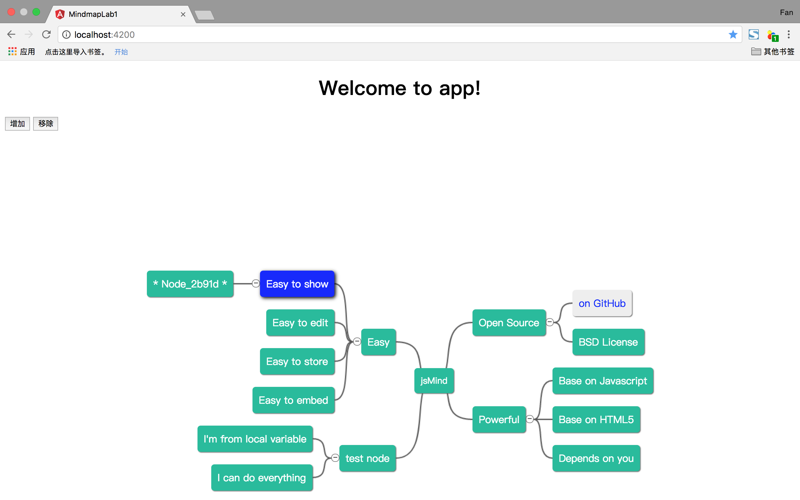

# 高级Web技术Lab1-Mindmap

Lab1 主要包含以下内容:

- Angular的安装配置
- jsMind的简单使用
- 部署到服务器

## Angular

### 一、安装Node与npm

首先，我们需要安装 Node.js 和 npm。

前往官网下载安装 Node.js , npm 会随着 Node.js 一同安装。

#### Node.js

Node.js 是一个基于 Chrome V8 引擎的 JavaScript 运行时，可以近似理解为脱离浏览器运行 JavaScript 代码的平台。常见用途是开发后端服务器，但是思维导图的 PJ 中是使用Spring boot 开发后端，而不是Node.js。

#### npm

npm = Node Package Manager，绝大部分的现代前端项目中都使用 npm 作为包管理工具。

>原生 npm 在中国的访问速度特别慢，如果没有稳定的翻墙环境，推荐使用阿里的国内 npm 镜像：https://npm.taobao.org/

### 二、安装Angular

以下的内容来自angular.cn中文官网:《快速上手》，https://angular.cn/guide/quickstart

好的工具能让开发更加简单快捷。

本章的目标是构建并运行一个超级简单的 TypeScript Angular 应用。使用 Angular CLI 来让每个 Angular 应用从风格指南的那些建议中获益。

在本章的末尾，你会对用 CLI 进行开发有一个最基本的理解，并将其作为其它文档范例以及真实应用的基础。

#### 步骤 1. 设置开发环境

在开始工作之前，你必须设置好开发环境。

如果你的电脑里没有 Node.js®和 npm，请安装它们。

>请先在终端/控制台窗口中运行命令 node -v 和 npm -v， 来验证一下你正在运行 node 6.9.x 和 npm 3.x.x 以上的版本。 更老的版本可能会出现错误，更新的版本则没问题。

然后全局安装 Angular CLI 。

```
npm install -g @angular/cli
```

#### 步骤 2. 创建新项目

打开终端窗口。

运行下列命令来生成一个新项目以及应用的骨架代码：

```
ng new mind-map
```

>请耐心等待。 创建新项目需要花费很多时间，大多数时候都是在安装那些 npm 包。

#### 步骤 3. 启动开发服务器

进入项目目录，并启动服务器。

```
cd mind-map
ng serve --open
```

ng serve 命令会启动开发服务器，监听文件变化，并在修改这些文件时重新构建此应用。

使用 --open（或 -o）参数可以自动打开浏览器并访问 http://localhost:4200/。

本应用会用一条消息来跟你打招呼：


## jsMind

jsMind 是一个显示/编辑思维导图的纯 javascript 类库，其基于 html5 的 canvas 进行设计。jsMind 以 BSD 协议开源，在此基础上你可以在你的项目上任意使用。

jsMind 官网是：http://hizzgdev.github.io/jsmind/developer.html

官方的示例demo：http://hizzgdev.github.io/jsmind/example/2_features.html，几乎覆盖了jsMind.js的所有功能。在之后的PJ中，如果有需要实现的功能，可以多多参考文档和这些例子。

### 将jsMind封装为Angular组件步骤

从链接：https://github.com/hizzgdev/jsmind/zipball/master ，下载jsMind的压缩包文件，解压后将文件夹重命名为jsmind，将jsmind文件夹放到mind-map/src/app文件夹下面。

#### 步骤1. 修改配置文件

首先，将jsMind文件封装为Angular组件必须先进行这样配置，将mind-map/tsconfig.json文件增加一行代码，允许编译后缀是js的JavaScript文件：

```
{
  "compileOnSave": false,
  "compilerOptions": {
    "allowJs": true, //增加一行，允许编译JavaScript文件
    "outDir": "./dist/out-tsc",
    "sourceMap": true,
    "declaration": false,
    "moduleResolution": "node",
    "emitDecoratorMetadata": true,
    "experimentalDecorators": true,
    "target": "es5",
    "typeRoots": [
      "node_modules/@types"
    ],
    "lib": [
      "es2017",
      "dom"
    ]
  }
}
```

#### 步骤2.  修改css样式

**修改全局的CSS样式**

在mind-map/src/styles.css文件增加jsMind的全局样式，具体的添加样式代码如下：

```css
/* You can add global styles to this file, and also import other style files */
/* You can add global styles to this file, and also import other style files */

/* stylelint-disable */
/*
 * Released under BSD License
 * Copyright (c) 2014-2015 hizzgdev@163.com
 *
 * Project Home:
 *   https://github.com/hizzgdev/jsmind/
 */

/* important section */
.jsmind-inner{position:relative;overflow:auto;width:100%;height:100%;}/*box-shadow:0 0 2px #000;*/
.jsmind-inner{
  moz-user-select:-moz-none;
  -moz-user-select:none;
  -o-user-select:none;
  -khtml-user-select:none;
  -webkit-user-select:none;
  -ms-user-select:none;
  user-select:none;
}

/* z-index:1 */
canvas{position:absolute;z-index:1;}

/* z-index:2 */
jmnodes{position:absolute;z-index:2;background-color:rgba(0,0,0,0);}/*background color is necessary*/
jmnode{position:absolute;cursor:default;max-width:400px;white-space:nowrap;overflow:hidden;text-overflow:ellipsis;}
jmexpander{position:absolute;width:11px;height:11px;display:block;overflow:hidden;line-height:7px;font-size:12px;text-align:center;border-radius:6px;border-width:1px;border-style:solid;cursor:pointer;}

/* default theme */
jmnode{padding:10px;background-color:#fff;color:#333;border-radius:5px;box-shadow:1px 1px 1px #666;}
jmnode:hover{box-shadow:2px 2px 8px #000;background-color:#ebebeb;color:#333;}
jmnode.selected{background-color:#11f;color:#fff;box-shadow:2px 2px 8px #000;}
jmnode.root{font-size:14px;}
jmexpander{border-color:gray;}
jmexpander:hover{border-color:#000;}

@media screen and (max-device-width: 1024px) {
  jmnode{padding:5px;border-radius:3px;font-size:14px;}
  jmnode.root{font-size:21px;}
}
/* primary theme */
jmnodes.theme-primary jmnode{background-color:#428bca;color:#fff;border-color:#357ebd;}
jmnodes.theme-primary jmnode:hover{background-color:#3276b1;border-color:#285e8e;}
jmnodes.theme-primary jmnode.selected{background-color:#f1c40f;color:#fff;}
jmnodes.theme-primary jmnode.root{}
jmnodes.theme-primary jmexpander{}
jmnodes.theme-primary jmexpander:hover{}

/* warning theme */
jmnodes.theme-warning jmnode{background-color:#f0ad4e;border-color:#eea236;color:#fff;}
jmnodes.theme-warning jmnode:hover{background-color:#ed9c28;border-color:#d58512;}
jmnodes.theme-warning jmnode.selected{background-color:#11f;color:#fff;}
jmnodes.theme-warning jmnode.root{}
jmnodes.theme-warning jmexpander{}
jmnodes.theme-warning jmexpander:hover{}

/* danger theme */
jmnodes.theme-danger jmnode{background-color:#d9534f;border-color:#d43f3a;color:#fff;}
jmnodes.theme-danger jmnode:hover{background-color:#d2322d;border-color:#ac2925;}
jmnodes.theme-danger jmnode.selected{background-color:#11f;color:#fff;}
jmnodes.theme-danger jmnode.root{}
jmnodes.theme-danger jmexpander{}
jmnodes.theme-danger jmexpander:hover{}

/* success theme */
jmnodes.theme-success jmnode{background-color:#5cb85c;border-color:#4cae4c;color:#fff;}
jmnodes.theme-success jmnode:hover{background-color:#47a447;border-color:#398439;}
jmnodes.theme-success jmnode.selected{background-color:#11f;color:#fff;}
jmnodes.theme-success jmnode.root{}
jmnodes.theme-success jmexpander{}
jmnodes.theme-success jmexpander:hover{}

/* info theme */
jmnodes.theme-info jmnode{background-color:#5dc0de;border-color:#46b8da;;color:#fff;}
jmnodes.theme-info jmnode:hover{background-color:#39b3d7;border-color:#269abc;}
jmnodes.theme-info jmnode.selected{background-color:#11f;color:#fff;}
jmnodes.theme-info jmnode.root{}
jmnodes.theme-info jmexpander{}
jmnodes.theme-info jmexpander:hover{}

/* greensea theme */
jmnodes.theme-greensea jmnode{background-color:#1abc9c;color:#fff;}
jmnodes.theme-greensea jmnode:hover{background-color:#16a085;}
jmnodes.theme-greensea jmnode.selected{background-color:#11f;color:#fff;}
jmnodes.theme-greensea jmnode.root{}
jmnodes.theme-greensea jmexpander{}
jmnodes.theme-greensea jmexpander:hover{}

/* normal theme */
jmnodes.theme-normal jmnode{background-color:#A8C6DC;color:#000;}
jmnodes.theme-normal jmnode:hover{background-color:#fff !important; color: #000 !important;}
jmnodes.theme-normal jmnode.selected{background-color:#fff;color:#000;}
jmnodes.theme-normal jmnode.root{}
jmnodes.theme-normal jmexpander{}
jmnodes.theme-normal jmexpander:hover{}

/* nephrite theme */
jmnodes.theme-nephrite jmnode{background-color:#2ecc71;color:#fff;}
jmnodes.theme-nephrite jmnode:hover{background-color:#27ae60;}
jmnodes.theme-nephrite jmnode.selected{background-color:#11f;color:#fff;}
jmnodes.theme-nephrite jmnode.root{}
jmnodes.theme-nephrite jmexpander{}
jmnodes.theme-nephrite jmexpander:hover{}

/* belizehole theme */
jmnodes.theme-belizehole jmnode{background-color:#3498db;color:#fff;}
jmnodes.theme-belizehole jmnode:hover{background-color:#2980b9;}
jmnodes.theme-belizehole jmnode.selected{background-color:#11f;color:#fff;}
jmnodes.theme-belizehole jmnode.root{}
jmnodes.theme-belizehole jmexpander{}
jmnodes.theme-belizehole jmexpander:hover{}

/* wisteria theme */
jmnodes.theme-wisteria jmnode{background-color:#9b59b6;color:#fff;}
jmnodes.theme-wisteria jmnode:hover{background-color:#8e44ad;}
jmnodes.theme-wisteria jmnode.selected{background-color:#11f;color:#fff;}
jmnodes.theme-wisteria jmnode.root{}
jmnodes.theme-wisteria jmexpander{}
jmnodes.theme-wisteria jmexpander:hover{}

/* asphalt theme */
jmnodes.theme-asphalt jmnode{background-color:#34495e;color:#fff;}
jmnodes.theme-asphalt jmnode:hover{background-color:#2c3e50;}
jmnodes.theme-asphalt jmnode.selected{background-color:#11f;color:#fff;}
jmnodes.theme-asphalt jmnode.root{}
jmnodes.theme-asphalt jmexpander{}
jmnodes.theme-asphalt jmexpander:hover{}

/* orange theme */
jmnodes.theme-orange jmnode{background-color:#f1c40f;color:#fff;}
jmnodes.theme-orange jmnode:hover{background-color:#f39c12;}
jmnodes.theme-orange jmnode.selected{background-color:#11f;color:#fff;}
jmnodes.theme-orange jmnode.root{}
jmnodes.theme-orange jmexpander{}
jmnodes.theme-orange jmexpander:hover{}

/* pumpkin theme */
jmnodes.theme-pumpkin jmnode{background-color:#e67e22;color:#fff;}
jmnodes.theme-pumpkin jmnode:hover{background-color:#d35400;}
jmnodes.theme-pumpkin jmnode.selected{background-color:#11f;color:#fff;}
jmnodes.theme-pumpkin jmnode.root{}
jmnodes.theme-pumpkin jmexpander{}
jmnodes.theme-pumpkin jmexpander:hover{}

/* pomegranate theme */
jmnodes.theme-pomegranate jmnode{background-color:#e74c3c;color:#fff;}
jmnodes.theme-pomegranate jmnode:hover{background-color:#c0392b;}
jmnodes.theme-pomegranate jmnode.selected{background-color:#11f;color:#fff;}
jmnodes.theme-pomegranate jmnode.root{}
jmnodes.theme-pomegranate jmexpander{}
jmnodes.theme-pomegranate jmexpander:hover{}

/* clouds theme */
jmnodes.theme-clouds jmnode{background-color:#ecf0f1;color:#333;}
jmnodes.theme-clouds jmnode:hover{background-color:#bdc3c7;}
jmnodes.theme-clouds jmnode.selected{background-color:#11f;color:#fff;}
jmnodes.theme-clouds jmnode.root{}
jmnodes.theme-clouds jmexpander{}
jmnodes.theme-clouds jmexpander:hover{}

/* asbestos theme */
jmnodes.theme-asbestos jmnode{background-color:#95a5a6;color:#fff;}
jmnodes.theme-asbestos jmnode:hover{background-color:#7f8c8d;}
jmnodes.theme-asbestos jmnode.selected{background-color:#11f;color:#fff;}
jmnodes.theme-asbestos jmnode.root{}
jmnodes.theme-asbestos jmexpander{}
jmnodes.theme-asbestos jmexpander:hover{}
/* stylelint-enable */
```

**修改组件的CSS样式**

在mind-map/src/app/app.component.css文件增加jsMind的组件样式，具体的添加样式代码如下：

```
#jsmind_container {
    float: left;
    width: 100%;
    height: 800px;
}
```

#### 步骤3. 修改组件脚本
修改根组件脚本：mind-map/src/app/app.component.ts文件，增加常见的功能函数，添加代码的思路来源于jsMind的官方案例:https://github.com/hizzgdev/jsmind/blob/master/example/2_features.html。

```javascript
import { Component, OnInit } from '@angular/core';
// 引入jsmind.js文件
import * as jsMind from './jsmind/js/jsmind.js';

// jsMind的设置参数
const options = {
  container:'jsmind_container',
  theme:'greensea',
  editable:true
}

// 思维导图Mindmap渲染的json文件
const mind = {
  "meta":{
      "name":"jsMind remote",
      "author":"hizzgdev@163.com",
      "version":"0.2"
  },
  "format":"node_tree",
  "data":{"id":"root","topic":"jsMind","children":[
      {"id":"easy","topic":"Easy","direction":"left","children":[
          {"id":"easy1","topic":"Easy to show"},
          {"id":"easy2","topic":"Easy to edit"},
          {"id":"easy3","topic":"Easy to store"},
          {"id":"easy4","topic":"Easy to embed"}
      ]},
      {"id":"open","topic":"Open Source","direction":"right","children":[
          {"id":"open1","topic":"on GitHub", "background-color":"#eee", "foreground-color":"blue"},
          {"id":"open2","topic":"BSD License"}
      ]},
      {"id":"powerful","topic":"Powerful","direction":"right","children":[
          {"id":"powerful1","topic":"Base on Javascript"},
          {"id":"powerful2","topic":"Base on HTML5"},
          {"id":"powerful3","topic":"Depends on you"}
      ]},
      {"id":"other","topic":"test node","direction":"left","children":[
          {"id":"other1","topic":"I'm from local variable"},
          {"id":"other2","topic":"I can do everything"}
      ]}
  ]}
}

@Component({
  selector: 'app-root',
  templateUrl: './app.component.html',
  styleUrls: ['./app.component.css']
})
export class AppComponent implements OnInit {
  title = 'app';

  mindMap;
  
  //初始化
  ngOnInit() {
    this.mindMap = jsMind.show(options, mind);
  }

  //移除节点
  removeNode() {
    const selected_id = this.mindMap.get_selected_node();
    if(!selected_id){
      console.log('please select a node first.');
      return;
    }

    this.mindMap.remove_node(selected_id);  

  }

  //增加节点
  addNode() {
    const selected_node = this.mindMap.get_selected_node(); // as parent of new node
    if(!selected_node){
      console.log('please select a node first.');
      return;
    }

    const nodeid = jsMind.util.uuid.newid();
    const topic = '* Node_'+nodeid.substr(0,5)+' *';
    const node = this.mindMap.add_node(selected_node, nodeid, topic);
  }  
}
```


#### 步骤4. 修改组件模板 
修改组件模板：src/app/app.component.html，添加jsmind渲染的div层，增加两个butoon按钮：增加节点或移除节点。

```javascript
<div style="text-align:center">
  <h1>
    Welcome to {{ title }}!
  </h1>
</div>

<button (click)="addNode()">增加</button>
<button (click)="removeNode()">移除</button>

<div id="jsmind_container"></div>
```

#### 步骤5. 演示界面

代码的改写之后，在mind-map文件夹内运行命令```ng serve``` 服务启动。在浏览器中打开```localhost:4200``` ,单击其中一个节点表示选中该节点，再单击界面左侧的“增加”或者“移除”，可以增加一个节点或删除一个节点。




#### 思考题

1. 组件模板部分的代码，增加节点或移除节点的函数程序的鲁棒性有一些问题，请尝试修正一下？
2. jsMind.js是一种渲染思维导图的js文件，还有其它的思维导图库文件，值得继续探索。在www.npmjs.com或者www.github.com 官网上搜索“mindmap”，搜索其他的思维导图库文件，可以尝试用在PJ中，为最终的项目做出更加丰富的功能，作为以后PJ的加分项。

## 部署到服务器

现在我们已经在本地使用 Angular 和 jsMind.js 搭建好了一个范例工程，接下来，我们可以将这个工程部署到服务器上，让所有人都能访问。

### Angular构建

在mind-map文件夹下,运行命令```ng build --prod```，将原来的项目编译成静态的资源文件，最终在mind-map文件夹下面会出现dist文件夹，将dist文件夹下的静态的资源文件部署到服务器上。

### 上传到服务器

在Amazon云服务上要有服务器运行的环境，可以选择安装Tomcat、Apache或Nginx等服务器软件，按照一般的教程在服务器上安装Tomcat、Apache或Nginx等服务器软件，然后将mind-map生成的dist文件夹内的文件上传到Amazon云服务器上。

这里考虑到后面的Lab3是基于Spring boot的Java Web开发，所以采用部署Tomcat的服务器环境，假设采用的服务器系统是Ubuntu 16.04 LTS。

#### 步骤1. 初始的操作
在服务器环境配置之前，我们先进行初始的操作，为后续的环境配置做好准备。
```
// 初始进入服务器，要更新软件程序
sudo apt-get update
// 下载jdk-10
wget -c --header "Cookie: oraclelicense=accept-securebackup-cookie" http://download.oracle.com/otn-pub/java/jdk/10+46/76eac37278c24557a3c4199677f19b62/jdk-10_linux-x64_bin.tar.gz
// 解压压缩包文件,得到jdk-10文件夹
tar -zxvf jdk-10_linux-x64_bin.tar.gz
// 将jdk-10文件夹移动到/etc/文件夹下
sudo mv jdk-10 /etc/
// 下载tomcat8
wget http://mirrors.tuna.tsinghua.edu.cn/apache/tomcat/tomcat-8/v8.5.30/bin/apache-tomcat-8.5.30.tar.gz
// 解压压缩包文件，得到apache-tomcat-8.5.30文件夹
tar -zxvf apache-tomcat-8.5.30.tar.gz
// 对apache-tomcat-8.5.30文件夹进行重命名tomcat8
sudo mv apache-tomcat-8.5.30 tomcat8
// 将tomcat8文件夹移动到/opt/文件夹下
sudo mv tomcat8 /opt/
```

#### 步骤2.环境变量的配置

首先对系统中Java运行环境变量的配置。这里使用的终端编辑器是nano，比vim编辑器要简单许多，具体的使用建议搜索查询教程。

**Java环境变量的配置**
```
// 打开Linux系统环境变量文件
 nano /etc/profile
// 在打开文件的最末尾加上Java环境变量信息
export JAVA_HOME=/etc/jdk-10
export JRE_HOME=$JAVA_HOME/jre
export CLASSPATH=.:$CLASSPATH:$JAVA_HOME/lib:$JRE_HOME/lib
export PATH=$PATH:$JAVA_HOME/bin:$JRE_HOME/bin
// 退出nano编辑器
ctrl+Exit，选择Y保存并退出
// 使环境变量文件生效
source /etc/profile
// 查看java的版本
java -version
```

如果在终端查看到如下的信息，说明配置成功了。

```
java version "10" 2018-03-20
Java(TM) SE Runtime Environment 18.3 (build 10+46)
Java HotSpot(TM) 64-Bit Server VM 18.3 (build 10+46, mixed mode)
```

**Tomcat配置**

配置Tomcat的bin目录下的startup.sh和shutdown.sh文件。

```
// 进入tomcat的bin目录
cd /opt/tomcat8/bin/
// 编辑startup.sh文件
nano startup.sh
// 在startup.sh文件的最顶部加上环境变量的配置
JAVA_HOME=/etc/jdk-10/
JRE_HOME=$JAVA_HOME/jre
CLASSPATH=.:$CLASSPATH:$JAVA_HOME/lib:$JRE_HOME/lib
PATH=$PATH:$JAVA_HOME/bin:$JRE_HOME/bin
TOMCAT_HOME=/opt/tomcat8
// 退出nano编辑器
ctrl+Exit，选择Y保存并退出
// 编辑shutdown.sh文件
nano shutdown.sh
// 在shutdown.sh文件的最顶部加上环境变量的配置
JAVA_HOME=/etc/jdk-10/
JRE_HOME=$JAVA_HOME/jre
CLASSPATH=.:$CLASSPATH:$JAVA_HOME/lib:$JRE_HOME/lib
PATH=$PATH:$JAVA_HOME/bin:$JRE_HOME/bin
TOMCAT_HOME=/opt/tomcat8
// 退出nano编辑器
ctrl+Exit，选择Y保存并退出
// 启动tomcat服务器
sudo ./startup.sh
```

如果在终端查看到如下的信息，说明Tomcat 启动成功了。

```
Using CATALINA_BASE:   /opt/tomcat8
Using CATALINA_HOME:   /opt/tomcat8
Using CATALINA_TMPDIR: /opt/tomcat8/temp
Using JRE_HOME:        /etc/jdk-10
Using CLASSPATH:       /opt/tomcat8/bin/bootstrap.jar:/opt/tomcat8/bin/tomcat-juli.jar
Tomcat started.
```

也可以在浏览器上打开"IPv4公有IP : 8080"，可以看到Tomcat启动成功的典型网页说明Tomcat启动成功了。

#### 步骤3.在Tomcat中部署Web项目

这里是将前面的Angualr项目通过命令``` ng build --prod```生成的dist文件夹内的文件上传到Tomcat的根目录ROOT文件夹下。

本机文件上传到服务器上的做法多种多样：WinSCP、Xftp、SCP、Rsync等等都可以，也采取一种简单而高效的做法，通过git实现本机文件push到github等代码托管平台上，再从github等代码托管平台上pull到服务器上。

这里提醒，“在Tomcat中部署Web项目”，具体的配置建议搜索教程。举例博客《在Tomcat中部署web项目》，链接 ：http://zzqhost.com/2017/04/20/在Tomcat中部署Web项目/


如果使用 AWS 服务器，默认的安全组规则会拦截服务器的入站流量。为了能够正常访问，我们需要放开对 8080 端口的限制：

1. 进入 AWS 控制面板，点击左边的【安全组】

2. 点击下方的【入站】->【编辑】

3. 增加入站规则： HTTP 或 HTTPS 可以允许他人访问你服务器上的网址；自定义 TCP 端口 8080 ，允许来源 【任意位置】。

如果一切正常，就可以通过 服务器公网 IP:8080 来访问你的工程了。

